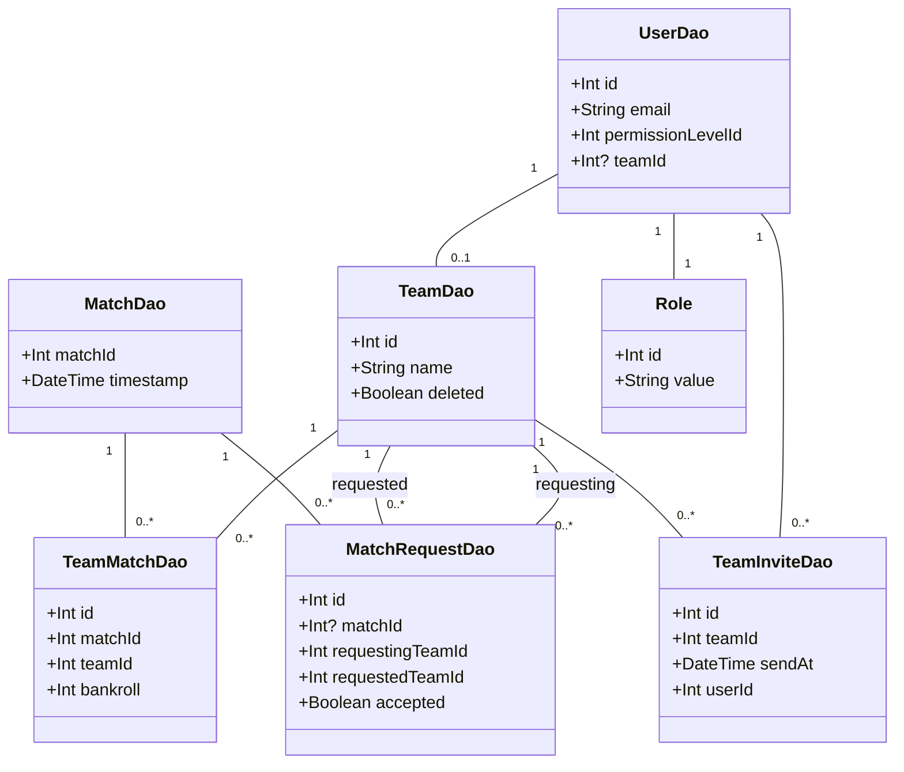

# PokerAI Web Backend & Other Serverless Functions

This repository contains a dockerized express server that serves as the backend for the PokerAI web application.


## Getting Started

Install all dependencies:

```bash
cd web-backend
pnpm install
```

Run the server in dev mode:

```bash
pnpm dev
```

The server will be running on `http://localhost:<PORT FROM ENV>`.

API specification can be found at `http://localhost:<PORT FROM ENV>/api-spec`.

To build the server:

```bash
pnpm build
```

### Project Structure

```
.
├── README.md               # This file
└── web-backend             # Express server
    ├── Dockerfile          # Dockerfile for the express server
    ├── api                 # API specification and autogenerated code
    │   ├── generated
    │   └── src
    ├── package.json        # Dependencies and scripts
    ├── src                 # Source code
    │   ├── app.ts          # Express app
    │   ├── config          # Configuration files
    │   ├── controllers     # Request handlers
    │   ├── middleware      # Middleware functions
    │   ├── routes          # Route definitions
    │   ├── server.ts       # Server entry point
    │   └── services        # Business logic
    ├── tsconfig.json
    └── pnpm-lock.yaml
```

### Environment Variables

Create a `.env` file in the root of the project with the following environment variables:

```
PORT=8080
GCLOUD_ADMIN_KEY=your-gcp-service-account-key-in-json
DATABASE_URL="mysql://webbackend:<password>@0.0.0.0:3306/pokerai-db?host=/cloudsql/pokerai-417521:us-east4:pokerai-sql"
```

To test locally, run cloud-sql-proxy using the [script](/setupproxy.sh).

## Datamodel

The data is stored in MySQL, the schema is as follows:

